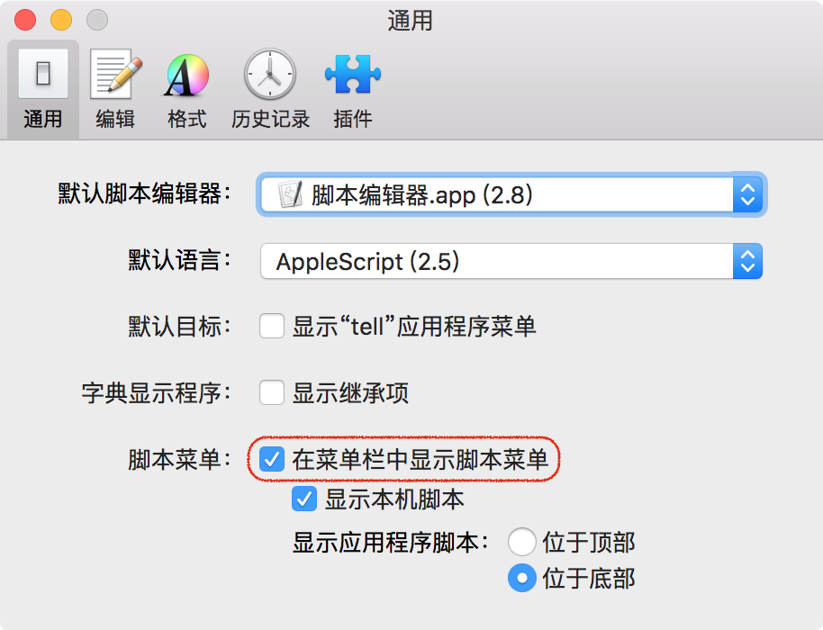
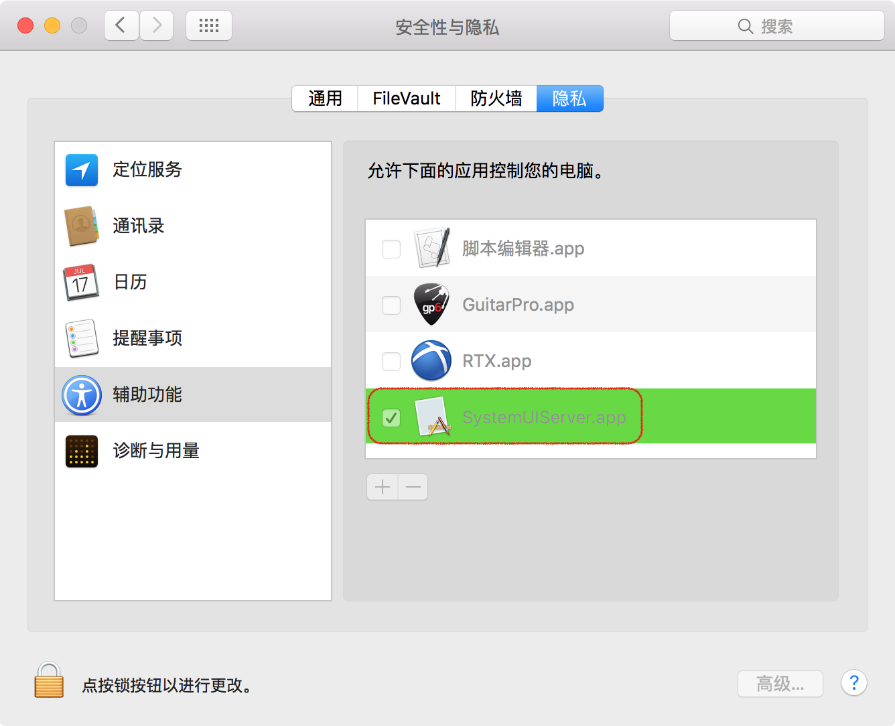
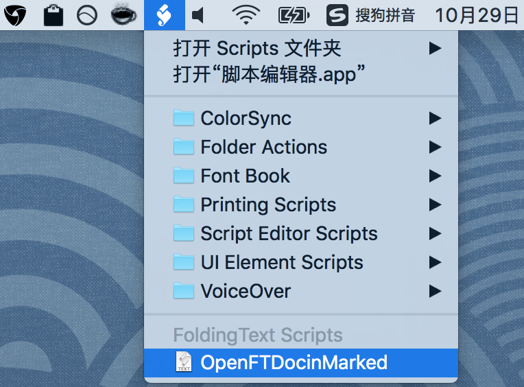

[How to install a script?](http://support.foldingtext.com/t/how-to-install-a-script/75/5)

[Script to open the current FoldingText file in Brett Terpstra’s Marked](http://support.foldingtext.com/t/script-to-open-the-current-foldingtext-file-in-brett-terpstras-marked/189)

[OpenFTDocinMarked.applescript](https://github.com/RobTrew/txtquery-tools/blob/master/utilities/OpenFTDocinMarked.applescript)

1-Show Script menu in menu bar
----

2-`SystemUIServer` would like to control this computer using accessibility features
----

3-Open `FoldingText Scripts` Folder
----

4-load OpenFTDocInMarked
----

5-OpenFTDocInMarked Demonstration
----

