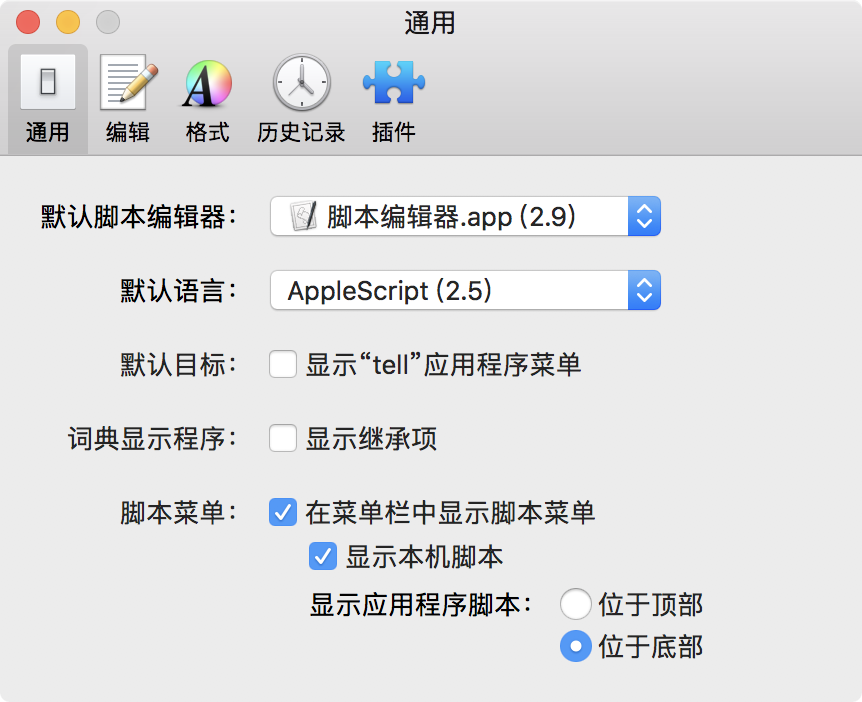
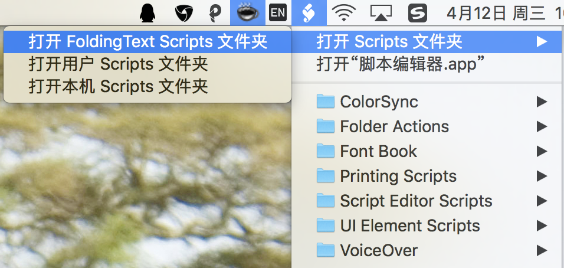
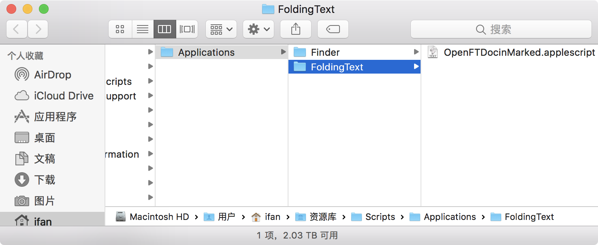
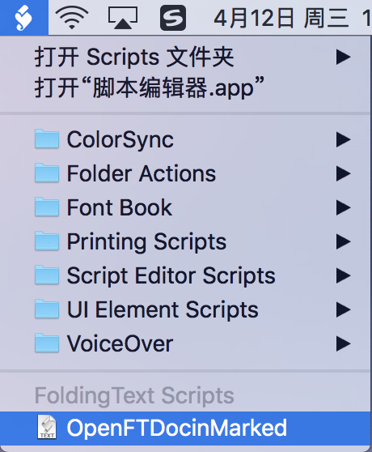
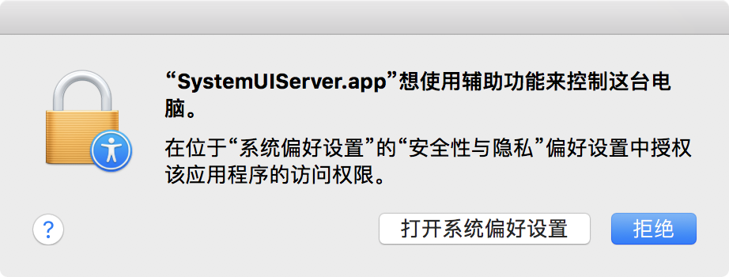
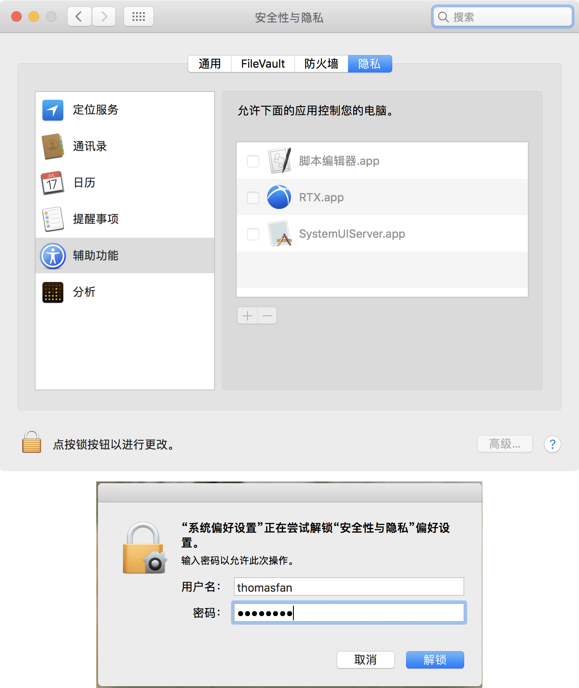
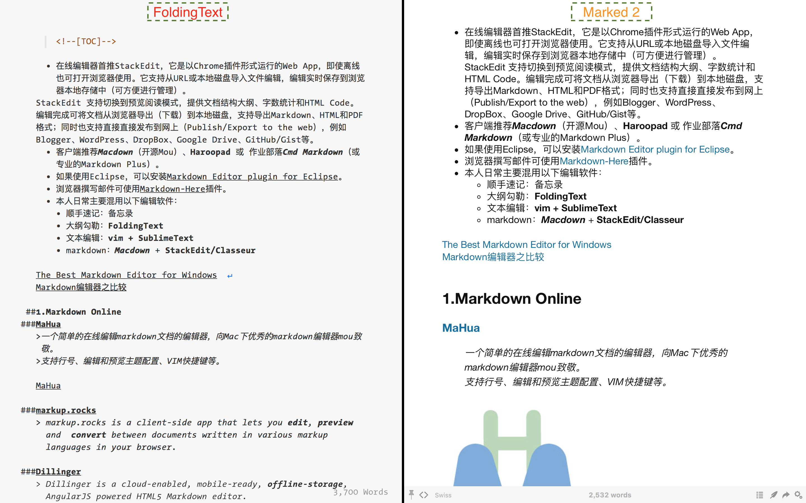

[How to install a script?](http://support.foldingtext.com/t/how-to-install-a-script/75/5)

[Script to open the current FoldingText file in Brett Terpstra’s Marked](http://support.foldingtext.com/t/script-to-open-the-current-foldingtext-file-in-brett-terpstras-marked/189)

[OpenFTDocinMarked.applescript](https://github.com/RobTrew/txtquery-tools/blob/master/utilities/OpenFTDocinMarked.applescript)

脚本编辑器-偏好设置
---

[x] 在菜单栏中显示脚本菜单

打开FoldingText-脚本菜单
---

将 `OpenFTDocinMarked.applescript` 脚本复制到 `~/Library/Scripts/Applications/FoldingText ` 目录下：

重新点击脚本菜单，下拉列表多了 `FoldingText Scripts` 分区及其  **OpenFTDocinMarked** 菜单项。

点击该菜单项，弹出辅助功能授权确认框。

grant `SystemUIServer` for control accessibility
---

打开 `系统偏好设置|安全性与隐私`，选中 **`辅助功能`**，点击左下角的锁，输入账号密码。

[x] SystemUIServer.app

OpenFTDocInMarked Demonstration
---

