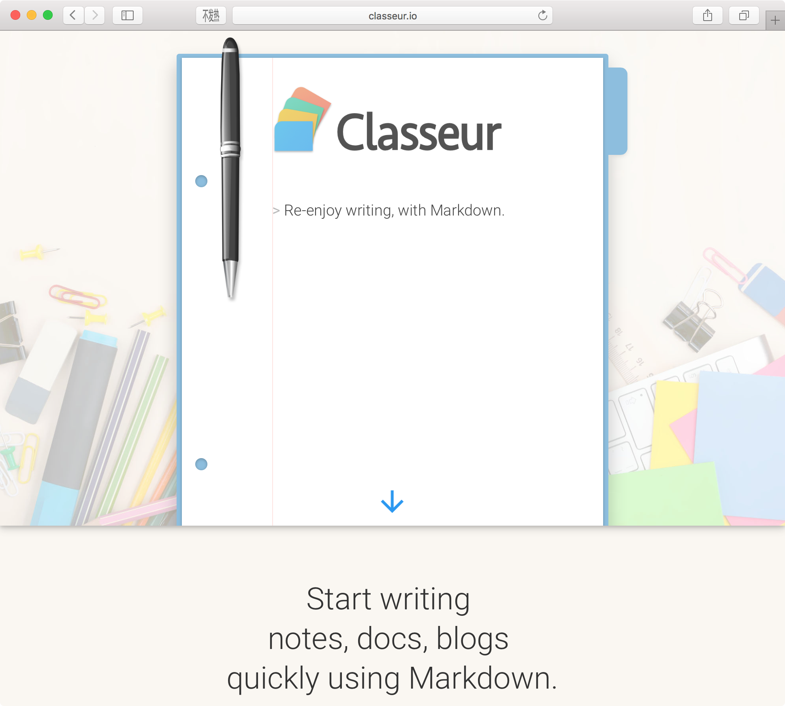
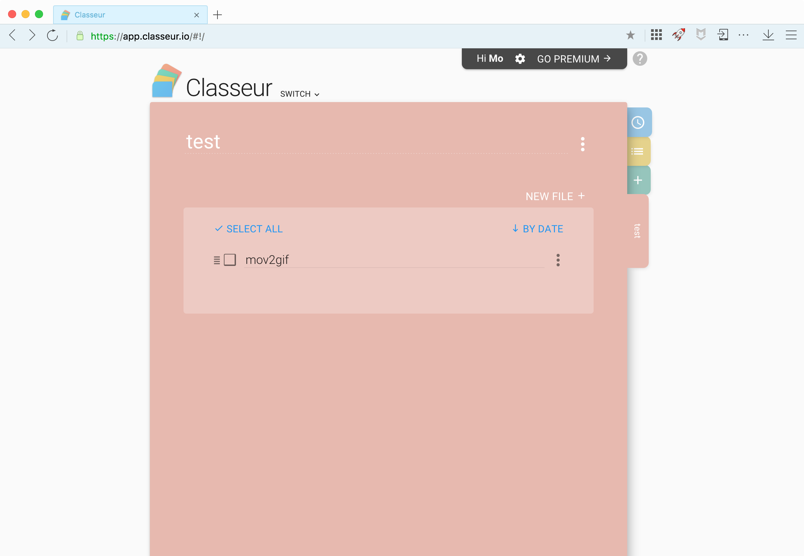

classeur.app
===

Start [classeur.app](http://classeur.io/) in the browser
----

+New Folder，+New File
----

Edit Mode
----

Side Preview
----

Menu Configuration
----

Status Bar & Side Bar
----

Preview Mode（Hide the Editor）
----

