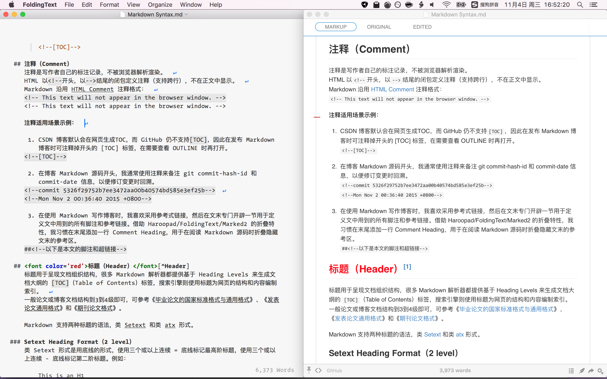
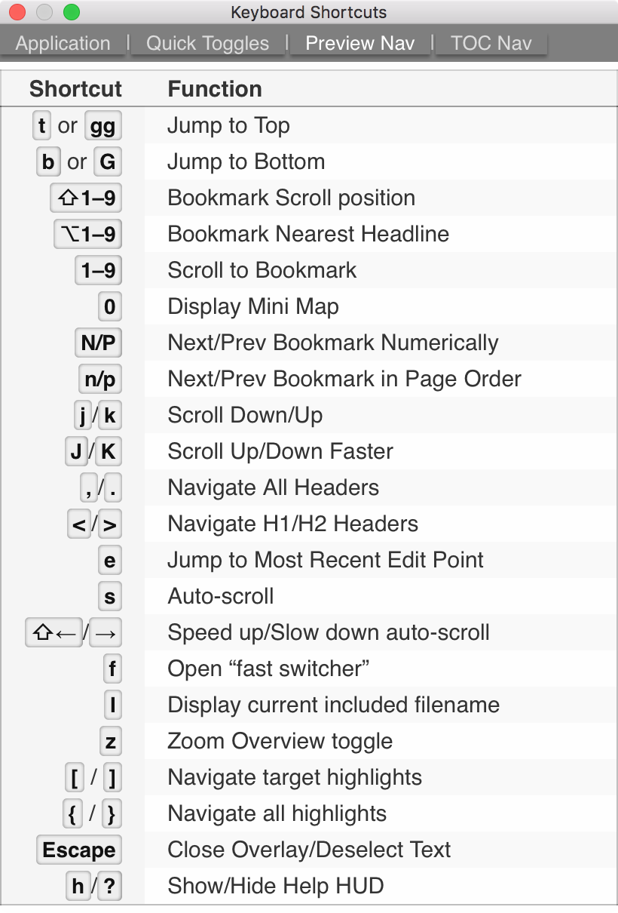
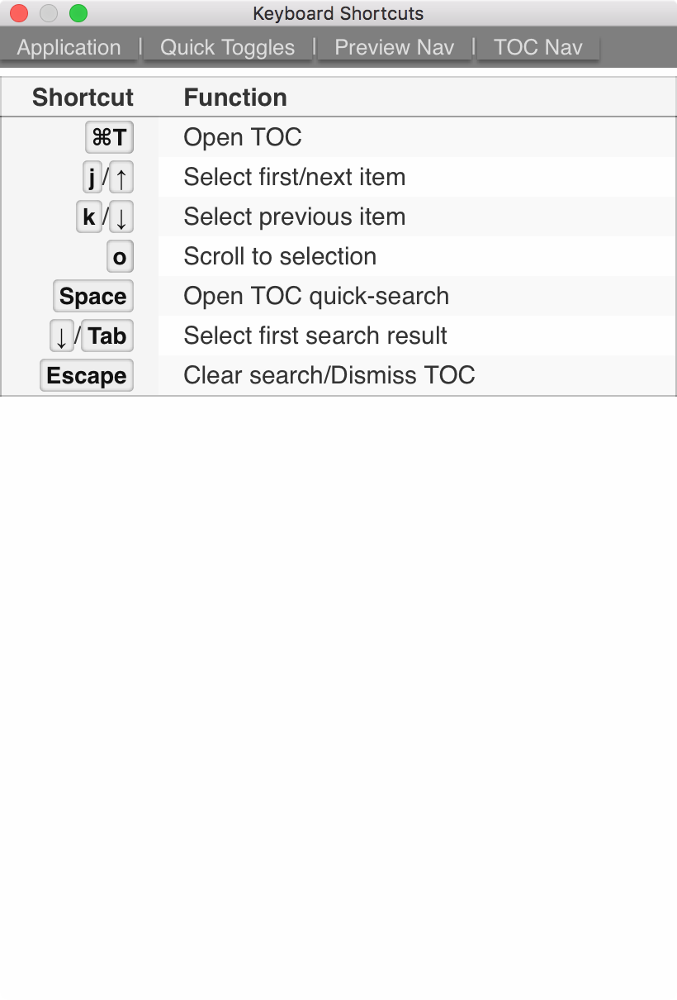

# [Marked](http://marked2app.com/)
[Marked 2 使用方法集锦：基础篇](http://www.waerfa.com/marked-2-basic-skills)

## Folding Text 调起 Marked 2
通过脚本 [OpenFTDocinMarked.applescript][] 调起 Marked 2 渲染预览 Markdown。  
当在 Folding Text 中修改保存 Markdown 文档时，Marked 2 会实时检测刷新。

## Preferences
### General

- Window
	- [x] Raise window on update：
		当在编辑器中修改保存文档时，将会调起Marked窗口。

- Status bar
	- [x] Show Style picker

### Preview
1. Preview behavior:
	- [x] Scroll to first edit：定位到编辑器当前修改点
		- [x] Show Edit Marker：显示红色的修改点标记符
	- [x] Enable Mini Map Navigation：开启 Minimap 导航支持。
	- [x] Headlines collapse sections：点击标题可以**折叠**。
2. Additional features: 
	- [x] Show scroll progress indicator
	- [x] Enable link popovers：鼠标悬停在链接上时，显示 title。

### Apps
Text Editor：选择 FoldingText  
Open in Editor 快捷键：<kbd>⌘</kbd><kbd>e</kbd>

- [x] Edit new files automatically
	当 Marked 2 新建文件时，将自动打开 External Editor(FoldingText) 进行编辑。

## Preview
### Preview_Menu
Shortcut  |  Function                       |  Comment
----------|---------------------------------|----------------------
<kbd>⌘</kbd><kbd>r</kbd> | Refresh            | 刷新(重新加载)
<kbd>⌘</kbd><kbd>u</kbd> | Toggle Source View | 查看 HTML 源码
<kbd>⌥</kbd><kbd>⌘</kbd><kbd>i</kbd> | High Contrast | 开启夜间模式

### Preview_Nav

#### 帮助
Shortcut  |  Function                       |  Comment
----------|---------------------------------|----------------------
`h` / `?`     | Show/Hide Help HUD              | 打开/关闭帮助导航仪浮层

#### 主题
默认主题（theme style）是Swiss，可切换测试 GitHub（<kbd>⌘</kbd><kbd>4</kbd>）主题。  
另外，推荐尝试复古的 Antique（<kbd>⌘</kbd><kbd>2</kbd>）和规矩的 Upstanding Citizen（<kbd>⌘</kbd><kbd>6</kbd>）。

#### 导航
Shortcut  |  Function                       |  Comment
----------|---------------------------------|----------------------
`e`         | Jump to Most Recent Edit Point  | 定位到最近编辑点(**e**dit)
`,` / `.`     | Navigate All Headers            | 基于 Header 导航
`<` / `>`     | Navigate H1/H2 Headers          | 基于 H1/H2 导航
`0`         | Display Mini Map                | 打开 MiniMap 导航 可按下`<ESC>`关闭
`z`         | Zoom Overview toggle            | 查看缩略图

#### 滚屏
Shortcut  |  Function                       |  Comment
----------|---------------------------------|----------------------
`t` / `gg`    | Jump to top like vim            | 跳转到顶部(top)
`b` / `G`     | Jump to bottom like vim         | 跳转到底部(bottom)
`j` / `k`     | Scroll Down/Up like vim         | 上/下滚动，亦适用于MiniMap
`J` / `K`     | Scroll Down/Up Faster           | 快速上/下滚动，亦适用于MiniMap
`Space` / <kbd>⇧</kbd>`Space`  | Page Down/Up   | 下/上翻页
`s`         | Auto-Scroll                     | 自动滚屏
<kbd>⇧</kbd><kbd>→</kbd>/<kbd>⇧</kbd><kbd>←</kbd> | Speed up/Slow down auto-scroll | 加速/减速自动滚屏

### TOC_Nav

Shortcut  |  Function                       |  Comment
----------|---------------------------------|----------------------
<kbd>⌘</kbd><kbd>t</kbd> | Open TOC              | 打开/关闭文档结构图 也可按下`<ESC>`关闭
`f` / `Space` | Open TOC quick-search           | 打开TOC搜索栏
`j` / `⬇️`    | Select next item                | 向下移动
`k` / `⬆️`    | Select previous item            | 向上移动
`o`         | Scroll to selection item        | 跳转到当前选中章节

## <!--以下是本文的脚注和超链接-->
[OpenFTDocinMarked.applescript]: https://github.com/RobTrew/txtquery-tools/blob/master/utilities/OpenFTDocinMarked.applescript

