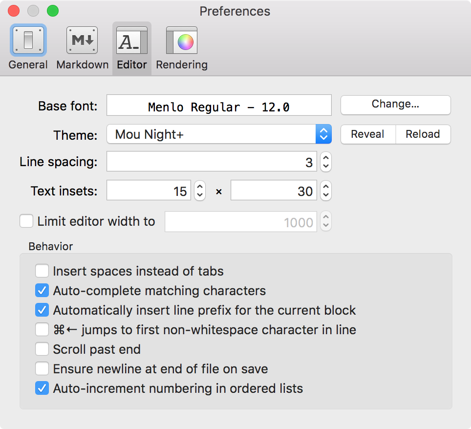

[TOC]

Macdown Preferences for [MultiMarkdown][]
===

##Macdown Preferences
###Markdown


####Document formatting
- [x] Smartpants  
参见下文。

####Block formatting
+ [x] Table  
参见下文。
+ [x] Fenced code block  
参见下文。

####Inline formatting
* [x] Intra-word emphasis  
*emphasis*  
**strong**
* [x] Strikethrough  
~~Strikethrough~~
* [x] Underline  
_underline_
* [x] Quote 
> Blockquote

	`Inline Code`

* [x] Highlight  
==Highlight==
* [x] Superscript  
 2<sup>0</sup> = 1
* [x] Autolink  
http://macdown.uranusjr.com/
* [x] Footnote  
参见下文。

###Editor


- Base Font  
	配置字体。
- Theme  
	选择主题（Mou Night+）。
- Behavior
	- [ ] Insert spaces instead of tabs
	建议不勾选此项（soft tabs），使用原生hard tabs（tabs characters）。

###Rendering


- CSS  
	选择样式（GitHub2）。

- [x] Syntax highlighted code block  
	Theme：`Coy` or `Tomorrow`  
	Accessory：`Language name`  
	- [x] Show line numbers

- [x] TeX-like math syntax 
	- [x] Use dollar sign ($) as inline delimiter  
	参考下文《MathJax》。

- [x] Task list syntax 

- [x] Detect table of contents token  
	github不支持`TOC`标记。
- [ ] Render newline literally  
	非块中自动检测自然行，而无需末尾添加两个空格。  
	github不完全支持自然行，还是建议关闭此项。
- [x] Scale preview based on editor font size

##Macdown对GFM的支持
###Multiple underscores in words（不支持）

Where Markdown transforms underscores (_) into italics, GFM ignores underscores in words, like this:

    wow_great_stuff
    do_this_and_do_that_and_another_thing.

由于Macdown开启了Underline，下划线包围的表示添加下划线（斜体只能使用*标记）。在计算机编程语言中定义的变量名往往包含很多下划线，需要转义。

###URL autolinking（支持）
###Strikethrough（支持）
###Fenced code blocks（支持）
###Syntax highlighting（支持）
We use Linguist to perform language detection and syntax highlighting. You can find out which keywords are valid by perusing the languages [YAML](https://github.com/github/linguist/blob/master/lib/linguist/languages.yml) file.

`ruby代码片段示例：`

```ruby
require 'redcarpet'
markdown = Redcarpet.new("Hello World!")
puts markdown.to_html
```

`OC代码片段示例：`

```obj-c
//
//  main.m
//  EmptyApplication
//
//  Created by faner on 15/9/5.
//  Copyright © 2015年 faner. All rights reserved.
//

#import <UIKit/UIKit.h>
#import "AppDelegate.h"

int main(int argc, char * argv[]) {
    @autoreleasepool {
        return UIApplicationMain(argc, argv, nil, NSStringFromClass([AppDelegate class]));
    }
}
```

------
StackEdit supports [**Markdown Extra** Plugins for Pagedown](https://github.com/jmcmanus/pagedown-extra), which extends **Markdown** syntax with some nice features.
以下是Macdown的相应支持。

##Macdown支持的Mardown Extras
###Tables

Item     | Value
-------- | ---
Computer | `$1600`
Phone    | `$12`
Pipe     | `$1`

### Fenced code blocks
GitHub's fenced code blocks are also supported with **Highlight.js** syntax highlighting:

```
// Foo
var bar = 0;
```

> **Tip:** To use **Prettify** instead of **Highlight.js**, just configure the **Markdown Extra** extension in the <i class="icon-cog"></i> **Settings** dialog.

> **Note:** You can find more information:

> - about **Prettify** syntax highlighting [here][prettify],
> - about **Highlight.js** syntax highlighting [here][highlightjs].

### Footnotes（支持）
You can create footnotes like this[^footnote].

### SmartyPants（支持）

SmartyPants converts ASCII punctuation characters into "smart" typographic punctuation HTML entities. For example:

|                  | ASCII                        | HTML              |
 ----------------- | ---------------------------- | ------------------
| Single backticks | `'Isn't this fun?'`            | 'Isn't this fun?' |
| Quotes           | `"Isn't this fun?"`            | "Isn't this fun?" |
| Dashes           | `-- is en-dash, --- is em-dash` | -- is en-dash, --- is em-dash |


### Table of contents（支持）
You can insert a table of contents using the marker `[TOC]`:

### MathJax（支持）
You can render *LaTeX* mathematical expressions using **MathJax**, as on [math.stackexchange.com][1]:
The *Gamma function* satisfying $\Gamma(n) = (n-1)!\quad\forall n\in\mathbb N$ is via the Euler integral

$$
\Gamma(z) = \int_0^\infty t^{z-1}e^{-t}dt\,.
$$

Macdown不支持的Mardown Extras
----
### UML diagrams(不支持)
You can also render sequence diagrams like this:

```sequence
Alice->Bob: Hello Bob, how are you?
Note right of Bob: Bob thinks
Bob-->Alice: I am good thanks!
```

And flow charts like this:

```flow
st=>start: Start
e=>end
op=>operation: My Operation
cond=>condition: Yes or No?

st->op->cond
cond(yes)->e
cond(no)->op
``` 

### Definition Lists（不支持）

Term 1
Term 2
:   Definition A
:   Definition B

Term 3

:   Definition C

:   Definition D

	> part of definition D

## <!--以下是本文的脚注和超链接-->
[^footnote]: Here is the *text* of the **footnote**.

[MultiMarkdown]:http://fletcherpenney.net/multimarkdown/

[prettify]: https://code.google.com/p/google-code-prettify/
[highlightjs]: http://highlightjs.org/

