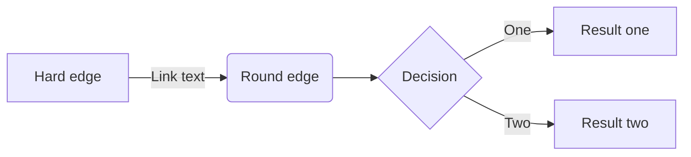
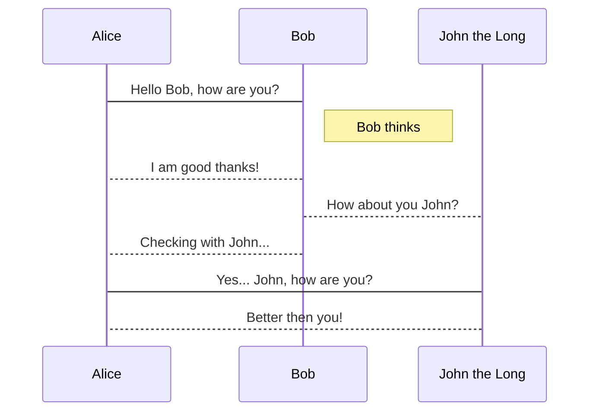

[How to draw diagram using by Haroopad](http://pad.haroopress.com/page.html?f=how-to-draw-diagram)

[Mermaid rendering broken](https://github.com/rhiokim/haroopad/issues/490)
Also it "works" the following, Ctrl+a, Del, and Ctrl+z

    

